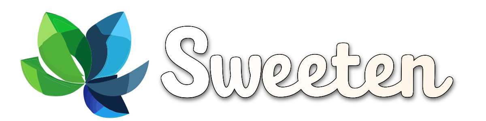

<div align="center">



## `sweeten` your daily `iced` brew

[](https://crates.io/crates/sweeten)
[](https://docs.rs/sweeten)
[](https://github.com/airstrike/sweeten/blob/master/LICENSE)
[](https://github.com/iced-rs/iced)

</div>

## Overview

`sweeten` provides sweetened versions of common `iced` widgets with additional
functionality for more complex use cases. It aims to maintain the simplicity and
elegance of `iced` while offering "sweetened" variants with extended
capabilities.

## Installation

If you're using the latest `iced` release:

```bash
cargo add sweeten
```

If you're tracking `iced` from git, add this to your `Cargo.toml`:

```toml
sweeten = { git = "https://github.com/airstrike/sweeten", branch = "master" }
```

## Current Features

### `Button`

A sweetened version of `iced`'s `button` widget with focus-related callbacks:

- `.on_focus(Message)` fires when the button gains keyboard focus
- `.on_blur(Message)` fires when it loses focus

Pairs with `sweeten::widget::operation::{focus_next, focus_previous}` to build
keyboard-navigable forms where any kind of widget can be focused.

### `Toggler`

A sweetened version of `iced`'s `toggler` widget that smoothly animates state
changes — the handle slides between positions and the fill color crossfades
between the off- and on-state styles.

```rust
toggler(self.is_on)
    .label("Enable notifications")
    .on_toggle(Message::Toggled)
```

### `MouseArea`

A sweetened version of `iced`'s `mouse_area` widget with an additional
`on_press_with` method for capturing the click position with a closure. Use it
like:

```rust
mouse_area("Click me and I'll tell you where!",)
    .on_press_with(|point| Message::ClickWithPoint(point)),
```

### `PickList`

A sweetened version of `iced`'s `PickList` which accepts an optional closure to
disable some items. Use it like:

```rust
pick_list(
    &Language::ALL[..],
    Some(|languages: &[Language]| {
        languages
            .iter()
            .map(|lang| matches!(lang, Language::Javascript))
            .collect()
    }),
    self.selected_language,
    Message::Pick,
)
.placeholder("Choose a language...");
```

> Note that the compiler is not currently able to infer the type of the closure,
> so you may need to specify it explicitly as shown above.

### `TextInput`

A sweetened version of `iced`'s `text_input` widget with additional focus-related features:

- `.on_focus` and `.on_blur` methods for handling focus events
- Sweetened `focus_next` and `focus_previous` focus management functions, which return the ID of the focused element

### `Row` and `Column`

Sweetened versions of `iced`'s `Row` and `Column` with drag-and-drop reordering
support via `.on_drag`:

```rust
use sweeten::widget::column;
use sweeten::widget::drag::DragEvent;

column(items.iter().map(|s| s.as_str().into()))
    .spacing(5)
    .on_drag(Message::Reorder)
    .into()
```

### `FitText`

A text widget that auto-scales its font size to fit the bounds it is laid out
into. Think CSS' `clamp(min, ideal, max)`, but the "ideal" is solved for
instead of specified — `sweeten` binary-searches the size range and picks the
largest font that still fits. Use it like:

```rust
use iced::Fill;
use sweeten::widget::fit_text;

fit_text("Big headline")
    .max_size(120)
    .min_size(16)
    .width(Fill)
    .height(Fill)
    .center()
```

Both `min_size` and `max_size` are optional — call neither and the font scales
within `[1.0, 1024.0]` pixels by default.

## Examples

For complete examples, see [`examples/`](examples/) or run an example like this:

```bash
cargo run --example mouse_area
```

Other examples include:
```bash
cargo run --example pick_list
cargo run --example text_input
cargo run --example fit_text
```

## Code Structure

The library is organized into modules for each enhanced widget:

- `widget/`: Contains all widget implementations
  - `button.rs`: Sweetened button with focus/blur callbacks
  - `toggler.rs`: Sweetened toggler with animated state changes
  - `mouse_area.rs`: Sweetened mouse interaction handling
  - `pick_list.rs`: Sweetened pick list with item disabling
  - `text_input.rs`: Sweetened text input with focus handling
  - `fit_text.rs`: Auto-scaling text that fits its bounds
  - (more widgets coming soon!)

## Contributing

Contributions are welcome! If you have ideas for new widgets or enhancements:

1. Fork the repository
2. Create a feature branch
3. Implement your changes with tests
4. Submit a PR

## License

MIT

## Acknowledgements

- [iced](https://github.com/iced-rs/iced)
- [Rust programming language](https://www.rust-lang.org/)
