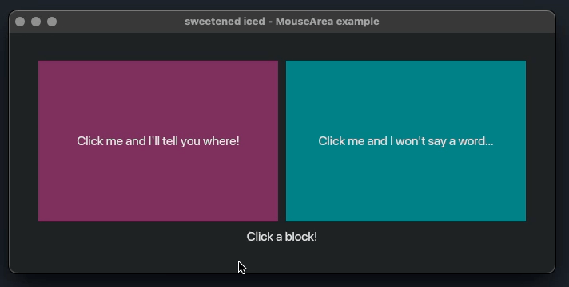
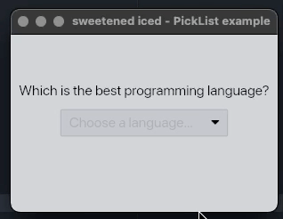

# Examples

- [Text Input](#text-input)
- [Mouse Area](#mouse-area)
- [Pick List](#pick-list)

Run any example using:

```bash
cargo run --example <example_name>
```

---

## Text Input

Demonstrates the enhanced text_input widget with focus/blur messages:

- `on_focus(Fn(String) -> Message)` - receive the current value when focused
- `on_blur(Message)` - emit a message when focus is lost
- Form validation with inline error display
- Tab navigation between fields

```bash
cargo run --example text_input
```

<div align="center">
  
</div>

---

## Mouse Area

Demonstrates the enhanced mouse area widget with click position tracking.

```bash
cargo run --example mouse_area
```

<div align="center">
  
</div>

---

## Pick List

Shows how to use the pick list with disabled items functionality.

```bash
cargo run --example pick_list
```

<div align="center">
  
</div>
