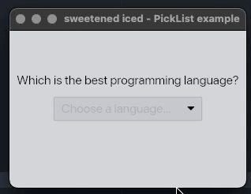

# Examples

- [Text Input](#text-input)
- [Mouse Area](#mouse-area)
- [Pick List](#pick-list)
- [Fit Text](#fit-text)
- [Flex](#flex)

Run any example using:

```bash
cargo run --example <example_name>
```

---

## Text Input

Demonstrates the enhanced text_input widget with focus/blur messages:

- `on_focus(Message)` - emit a message when the input gains focus
- `on_blur(Message)` - emit a message when the input loses focus
- Form validation with inline error display
- Tab navigation between fields

```bash
cargo run --example text_input
```

<div align="center">
  
</div>

---

## Mouse Area

Demonstrates the enhanced mouse area widget with click position tracking.

```bash
cargo run --example mouse_area
```

---

## Pick List

Shows how to use the pick list with disabled items functionality.

```bash
cargo run --example pick_list
```

<div align="center">
  
</div>

---

## Fit Text

Demonstrates the `fit_text` widget that auto-scales its font size to fit the
available bounds. Type a headline and drag the min/max sliders to watch the
binary-searched fit in action.

```bash
cargo run --example fit_text
```

---

## Flex

A live tour of `sweeten`'s CSS-flex `Row` / `Column` — covers every supported
property in isolation. The sticky sidebar switches between ten demo cards
(Basic, `justify-content`, `align-items`, `flex-grow`, `flex-shrink`,
`flex-basis`, `align-self`, `row-reverse`, padding & gap, kitchen-sink
"Mixed"), and the controls reflow whichever card is active.

```bash
cargo run --example flex
```
